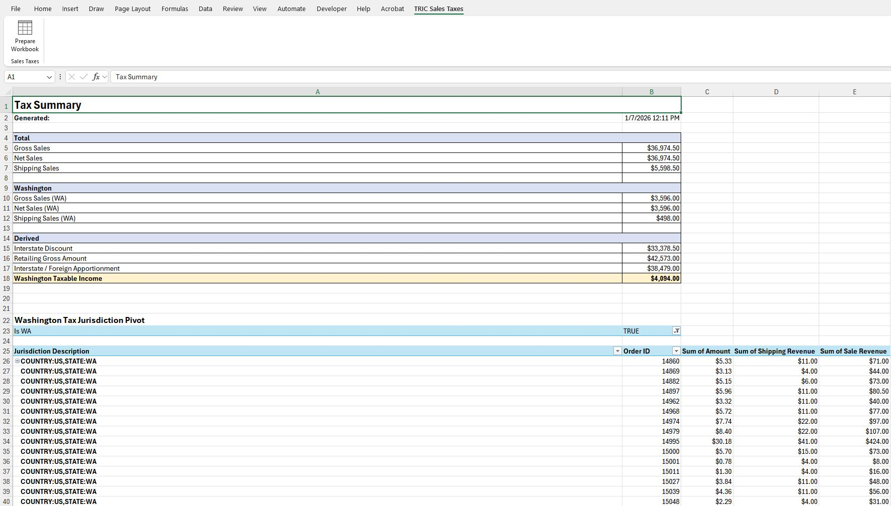

# TRIC Sales Tax Tools

TRIC Sales Tax Tools is an Excel add-in (`.xlam`) that helps prepare workbooks for sales tax reporting by generating a structured **Tax Summary** worksheet from existing data.

This repository contains:

- The VBA source code (`.bas`) used by the add-in
- A deterministic PowerShell build script that assembles the add-in
- A simple installer (`INSTALL.cmd`) for end users

The goal is a **repeatable, source-controlled build** that produces a clean Excel add-in with a custom ribbon UI — without manual editing inside Excel.

---

## What the Add-in Does

Once installed and enabled in Excel, it adds a **TRIC Sales Taxes** tab to the ribbon with a **Prepare Workbook** button.

**Prepare Workbook**:

- Creates or refreshes a *Tax Summary* worksheet
- Collects and organizes the data needed for sales tax reporting
- Does **not** modify your original source data

The result will look like this:



## Download the Report Data

The macro must run on specifically formatted accounting data that Squarespace provides. To get this data:

1. Navigate to https://tric.squarespace.com/config/commerce/selling-tools/accounting
2. Download the report for the desired time frame

---

## Repository Structure

```
TRIC-Sales-Tax-Tools/
│
├─ screenshots/               # For demonstration in the README
├─ src/
│  └─ SalesTaxTool.bas        # VBA source (source of truth)
│
├─ build-addin.ps1            # PowerShell build script
├─ INSTALL.cmd                # End-user installer launcher
└─ README.md                  # This file
```

The `src` folder is the source of truth for all of the VBA logic. The `.ps1` script contains the build logic.

`INSTALL.cmd` is the recommended way to install/update the add-in.

---

## Requirements

- Windows
- PowerShell (Windows PowerShell or PowerShell 7+; comes with Windows)
- Microsoft Excel (Microsoft 365, or version 2021+)

No additional libraries or dependencies are required.

---

## Installing the Add-in (Recommended)

1. Clone (or download the files from) this repository
2. Close Excel (important if updating an existing install)
3. Double‑click `INSTALL.cmd`
4. Wait for the installer to complete

### First-time install

After installation:

1) Open Excel
2) File -> Options -> Add-ins
3) Manage: Excel Add-ins -> Go...
4) Browse... -> select the add-in `TRIC Sales Tax Tools`
5) Click OK

You should now see a **TRIC Sales Taxes** tab in the ribbon.

### Updating an existing install

Follow the same installation instructions. The install script will update the addin for you.

If the add-in was already enabled:

- You do **not** need to re‑enable it
- Simply restart Excel to load the updated version

---

## Using the Add-in

1. Open a workbook containing your sales data
2. Go to the **TRIC Sales Taxes** tab
3. Click **Prepare Workbook**

The add-in will generate or update the **Tax Summary** worksheet automatically and bring you to it.

---

## Development & Build Process

This project intentionally avoids manual steps inside Excel.

### Source of truth

- All VBA code lives in `.bas` files under `src/`
- The add-in is always generated from source

### Build steps (automated)

The build script:

1. Creates a temporary `.xlsm`
2. Imports all `.bas` modules
3. Saves as `.xlam`
4. Injects Ribbon XML (2006 + 2010 schemas)
5. Installs the add-in into Excel’s AddIns folder

This ensures:

- Consistent builds
- No drift between source and installed add-in
- Easy updates

---

## Common Issues

### "Cannot overwrite add-in because Excel is using it"

Excel keeps add-ins locked while loaded.

**Fix**:

- Close Excel completely
- Re‑run `INSTALL.cmd`

---

## Notes

- The build script is designed to fail fast and never partially overwrite a live add-in
- Ribbon UI is generated programmatically to avoid manual XML editing
- The project favors clarity and determinism over cleverness

---

## License - MIT

This project is free and open source software. See the terms of the [MIT License](LICENSE) here.

